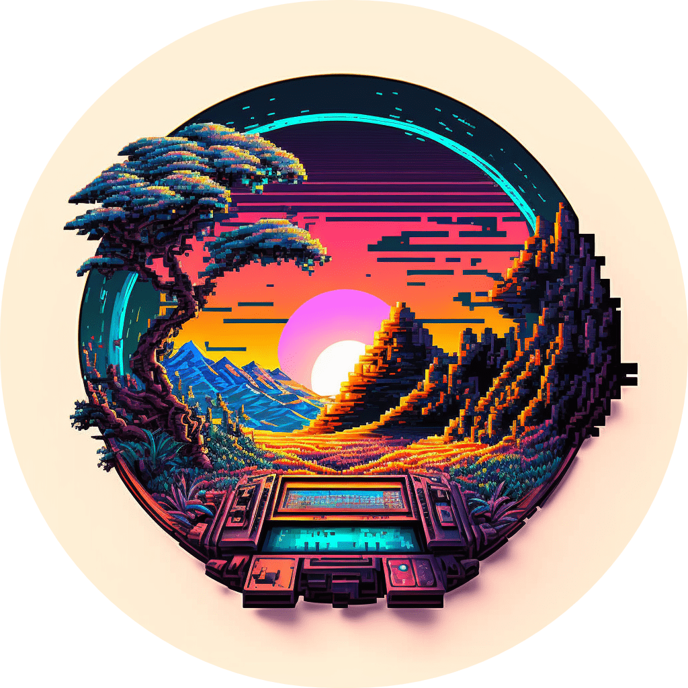

<a name="readme-top" id="readme-top"></a>

<!-- PROJECT SHIELDS -->
<!--
*** I'm using markdown "reference style" links for readability.
*** Reference links are enclosed in brackets [ ] instead of parentheses ( ).
*** See the bottom of this document for the declaration of the reference variables
*** for contributors-url, forks-url, etc. This is an optional, concise syntax you may use.
*** https://www.markdownguide.org/basic-syntax/#reference-style-links
-->

<!-- PROJECT LOGO -->
<br />
<div align="center">
  <a href="https://github.com/clementlebas/light-image-gallery">
    
  </a>

  <h2 align="center">light-image-gallery</h3>
  <a href="https://gallery.clementlebas.dev/">View Demo</a>
  ·
  <a href="https://github.com/clementlebas/light-image-gallery/issues">Report Bug</a>
  <br />
  <br />
</div>

<!-- TABLE OF CONTENTS -->
<details>
  <summary>Table of Contents</summary>
  <ol>
    <li>
      <a href="#about-the-project">About The Project</a>
    </li>
    <li><a href="#prerequisites">Prerequisites</a></li>
    <li><a href="#installation">Installation</a></li>
    <li><a href="#edit-content">Edit content</a></li>
    <li><a href="#deploy">Deploy</a></li>
  </ol>
</details>

## About The Project

  <p align="left" id="about-the-project">
    This React application serves as a template for building a lightweight and elegant image gallery. The application utilizes a JSON file to store data about the gallery and images are loaded from a specific folder. The color scheme of the application and header with contact information are fully customizable to suit the user's needs. 
    <br />
    This application is perfect for those looking for a simple and efficient way to showcase their images in a professional and attractive manner.
    <br />
    <br /> 
  </p>


<!-- ABOUT THE PROJECT -->

---

## **Prerequisites**

If you haven't already, you need to download GIT and NodeJS :

- [nodejs.org](https://nodejs.org/)
- [git-scm.com](https://git-scm.com/downloads)

I recommand to minify your image to improve your site loading performance ([imagecompressor.com](https://imagecompressor.com/), [compressnow.com](https://compressnow.com/))

## **Installation**

First, start by clicking the 'Use this template' button and 'Create a new repository'. It will create a clone of this repository.


Then, name it whatever ya want.


Once your new repository is created , enter the following command into your favorite terminal:

```sh
 git clone https://github.com/<--USER-->/<--REPO-->
 cd <--FOLDER-NAME-->
```

Then you need to install dependencies into your project so the stuff actually works !

```sh
npm i
```

<p align="right">(<a href="#readme-top">back to top</a>)</p>

<!-- USAGE EXAMPLES -->

## **Edit content**

To edit the content, everything happens in `src/configs` folder. Everything is optionnal so custom the content as you wish !

### **Header**

- Place your profile picture in `src/configs` folder

- Edit the **header** variable in `src/configs/data.tsx` file :

```json
{
  title: "Hey there, I'm Billy Crawford.",
  description: "Welcome to my images gallery !",
  image: require("./profile.png"),
  disabled: false,
}
```

- You can also add your social link in the **social** variable :

```json
{
  "github": "https://github.com/billycrawford",
  "twitter": "https://twitter.com/billycrawford",
  "linkedin": "https://www.linkedin.com/in/billycrawford",
  "disabled": false
}
```

### **Images galleries**

- Place your images in the `src/configs/images` folder. Actually, the image extension supported are : **eot,svg,ttf,woff,woff2,png,jpg,gif,webp,jpeg**

- Edit the **galleries** variable in `src/configs/data.tsx` file :

```json
[
  {
    category: "Category name",
    images: [
      {
        name: "image.png", // Important: specify the extension
        description: "Description of image 1",
      },
      {
        name: "image2.png",
        description: "Description of image 2",
      },
      ..., // duplicate image object for more
    ],
  },
  ..., // duplicate gallery object for more
]
```

### **Colors**

You can change the color of your site with the light and dark mode in `src/configs/colors.scss` file :

```css
.app.light {
  --color-primary: #f7f7f7;
  --color-secondary: #dfe3ee;
  --color-text: #001a2c;
}

.app.dark {
  --color-primary: #002137;
  --color-secondary: #001a2c;
  --color-text: #f1f1e6;
}
```

<p align="right">(<a href="#readme-top">back to top</a>)</p>

## **Deploy**

- **Run locally!**

  To see it in action in your browser, run the start script:

```sh
npm run start
```

- **Deploy onto a live website!**

  1. First, create a Netlify account : [netlify.com](https://app.netlify.com/)
  2. Then click on 'Import an existing project' and connect your github account :
     
  3. Pick your hithub repo create with the template :
     
  4. Then click on 'Deploy' (the site deployment can be a bit long)
  5. Netlify will give you a random domain _(ex: https://voluble-bavarois-6f8126.netlify.app)_.
     You are free to buy a custom domain if you want by following Netlify set up !

<p align="right">(<a href="#readme-top">back to top</a>)</p>

---

**_VOILA !_** 🎉

You're brand new gallery images should be ready to go!

Share it with some friends, family members, employers?

<div align="center">
<a target="_blank" href="https://www.producthunt.com/posts/light-image-gallery?utm_source=badge-featured&utm_medium=badge&utm_souce=badge-light&#0045;image&#0045;gallery" target="_blank"></a>
</div>


<p align="right">(<a href="#readme-top">back to top</a>)</p>
